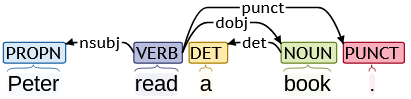
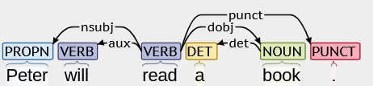

# JSON-NLP 2 RDF / Triple Mapping Language (JRML)

(C) 2020 by [Semiring Inc.], [Damir Cavar]

This repo contains the [ANTLR 4] specification of the [Semiring] [JSON-NLP] to [RDF]/[JSON-LD]/triples Mapping Language, or short JRML.

Keywords: [JSON-NLP], [RDF], [JSON-LD], [ANTLR 4], [NLP], [AI], [Knowledge Graphs]

## The Goal

Mapping languages like [RML] or [R2RML] are limited when it comes to the complex mapping issues that emerge when mapping [RDF], triples, or [JSON-LD] from unstructured text, spoken language (transcripts), or image content descriptions.

The [JSON-NLP] format, depending on the underlying NLP components, contains rich linguistic annotations at different linguistic levels (e.g. lexical, syntactic, semantic). Semantic properties encoded for example as Knowledge Graphs (or RDF triples) are related to all these different properties, depending on multiple cooccurrences and particular features.

For example, imagine a very simplistic approach of mapping linguistic properties from just the dependency tree for a particular sentence like "*Peter read a book.*"

By picking the verb and the dependent elements from the sentence labeled *nsubj* and *dobj* we could construct a simple triple (*Peter*, *read*, *book*). We do not know exactly which semantic version of *read* the main predicate represents in this construction. If we compare the different constructions *to read her fortune* or *to read her like a book*, *reading the clouds or the waves*, *read dig for dog*, *the thermometer reads 30*, you can see that there are different meanings of *read*. JSON-NLP can disambiguate those different meanings and provide the [PropBank] ID of the main predicate (or verb). In a more accurate [RDF] or [JSON-LD] representation we might want to refer to the semantically narrower representation of the verb. We would like to have a mapping instrument or language that allows us to pick this specific ID or label for the verb from [JSON-NLP].

It is also easy to see that the sentence *Peter read a book* is in fact a claim about an event in the past. Assuming that the speaker or writer had no intentions to deceive the reader, we could assume that the extracted triple is claimed to be true. On the other hand, we know that a sentence like *Peter will read a book* is describing a potential future event. When we extract the [RDF] triple, we might want to take this knowledge into account and provide a *non-factive* attribute to the triple. However, the approach based on just the dependency parse tree as explained above, would not allow us to detect the difference:

In fact, the information that the sentence is in *future tense* is not obvious in the dependency parse tree. [JSON-NLP], however, provides this information at the sentence and clause level. To access it and make the correct decision about the extraction of the [RDF] triple and semantic mapping into some Description Logic representation, we use JRML here.

The text that we want to process might contain anaphoric expressions, as for example in:

*Mary read a book. She enjoyed it.*

In these two sentences we automatically understand that *she* refers to *Mary*, and *it* to *book*. Our [JSON-NLP] provides this information in its coreference section. To generate a triple like (*Mary*, *enjoy*, *book*) from *She enjoyed it*, we need to dereference the pronouns and replace them with the entities from the preceding context that semantically and morpho-syntactically fit.

JRML simplifies the access to [JSON-NLP] encoded properties. It provides a simple access language to highly complex linguistic annotation dependencies in the rich [JSON-NLP] format. JRML makes it extremely easy to map highly semantically accurate [Knowledge Graphs] and representations of meaning from content in unstructured text, spoken language transcripts, or image descriptions.

In addition to that, JRML parsers provide the possibility to link the [JSON-NLP] processing with

We use [ANTLR] to generate extremely efficient, fast, and scalable [JSON-NLP] to [RDF] parsers/mappers for [Go], [Java], [C++].

## Examples of JRML

Rules are preceded by the *Rule* keyword, followed by a name and a colon:

    Rule myRule:

The rule-body contains a pattern that uses variable names in a clause and sentence, a production rule, and output triples:

    X[dep="nsubj"] Y[pos="VERB"] Z[dep="dobj"] --> (X.lemma, Y.lemma, Z.lemma)

The simple mapping rule above will generate the triple (*John*, *call*, *teacher*) from the sentence *John called his teachers*. We can extend the rule in various forms, including specification of other properties in the output, as for example the Part-of-Speech tag, a specific annotation or attribute value associated with the predicate, or a concrete value. Production rules could be formulated as:

    (X.lemma, "hasAge", 32)
    (X.lemma, Y.lemma[date="08/01/2020"], Z.lemma[num="pl"])
    (X.lemma [gen="male", animate], Y.lemma, Z.lemma [num="pl", animate=true] )

In the attribute value annotation, we allow for logical checks as with *animate* in the case of X. This *animate* is interpreted as *set the animate attribute of the matching entity X in the clause to true*. The *animate=true* attribute on Z does the same thing explicitely.

The matching part of a rule allows for specification of various feature value attributes and larger number of variables. Variables mentioned in the output portion of the mapping rule have to be defined in the matching portion of it.

The file *test.dat* provides some more examples of the complexity the language and rules in the matcher and output generator. Since the rules are not meant to make sense, just to test the parser, we recommend not to waste time by trying to interpret them in any sensible semantic or pragmatic way.

## Generating Lexer and Parser

To generate the Lexer and Parser in Java or Go, follow the [ANTLR] installation and setup instructions. We mainly focus on [Go] in a RESTful Microservice architecture:

- [ANTLR 4 for Go](https://github.com/antlr/antlr4/blob/master/doc/go-target.md)

## General Note

To test the [Semiring] [Natural Language Processing] (NLP) [SaaS](https://en.wikipedia.org/wiki/Software_as_a_service) pipeline for English, use this [Demo site](https://demo.semiring.com/). For other languages and features, [contact Semiring Inc.](https://semiring.com/contact/) directly.

The output of common domain independent and domain specific text to RDF/JSON-LD triple matchings will be made available on the [Demo site](https://demo.semiring.com/).

[Damir Cavar]: https://github.com/dcavar "Damir Cavar"
[Semiring Inc.]: https://semiring.com/ "Semiring Inc."
[Semiring]: https://semiring.com/ "Semiring Inc."
[JSON-NLP]:  "JSON-NLP"
[RML]: https://rml.io/specs/rml/ "RML"
[R2RML]: https://www.w3.org/TR/r2rml/  "R2RML"
[NLP]: https://en.wikipedia.org/wiki/Natural_language_processing "Natural Language Processing"
[Natural Language Processing]: https://en.wikipedia.org/wiki/Natural_language_processing "Natural Language Processing"
[PropBank]: https://propbank.github.io/ "The Proposition Bank"
[RDF]: https://en.wikipedia.org/wiki/Resource_Description_Framework "RDF"
[JSON-LD]: https://en.wikipedia.org/wiki/JSON-LD "JSON-LD"
[Knowledge Graphs]: https://en.wikipedia.org/wiki/Knowledge_Graph "Knowledge Graphs"
[ANTLR]: https://www.antlr.org/ "ANTLR"
[ANTLR 4]: https://www.antlr.org/ "ANTLR 4"
[Go]: https://golang.org/ "Golang"
[Java]: https://jdk.java.net/ "Java"
[C++]: https://en.wikipedia.org/wiki/C%2B%2B "C++"
